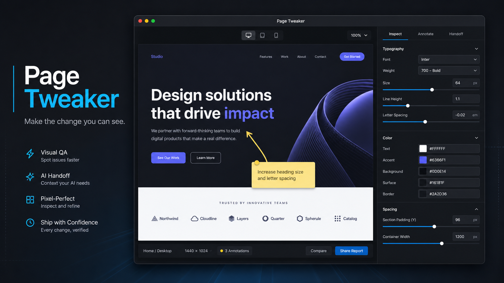
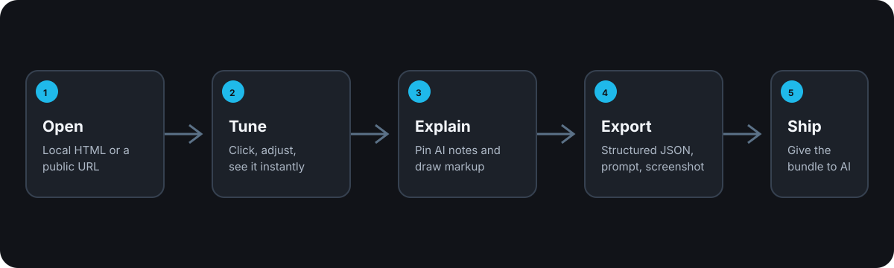

# Page Tweaker

> Make the change you can see.


Page Tweaker is a focused macOS desktop app for the frustrating last mile of AI-generated HTML: the report, interface, or landing page is almost right, but getting it there requires too much back-and-forth.

Open the page. Click what looks wrong. Tune the visible value. Mark up what needs a bigger change. Export one handoff bundle that gives an AI or developer the exact visual context to finish the work.



*Concept render. A real product screenshot walkthrough remains planned.*

## Why it exists

“Make the header smaller” is not an implementation instruction. It is a guess that becomes a loop of edits, previews, and more guesses.

Page Tweaker puts the visual decision where it belongs: on the page itself. It is not a browser extension, full CSS editor, or no-code site builder. It is a fast visual QA and AI-handoff layer for pages that are already close.



## What it does

- Opens a local HTML artifact or public `http(s)` URL in a dedicated desktop workspace.
- Lets you select visible elements and preview typography, spacing, and color adjustments immediately.
- Supports plain-text replacement when the words need to fit the layout.
- Pins natural-language AI notes to elements and supports freehand markup with a plain-language explanation that travels in the export.
- Exports `handoff.json`, `prompt.md`, and an annotated screenshot when capture is available.
- Keeps the original file and page untouched. Every adjustment is preview-only until someone applies the exported handoff.

## How the handoff works

1. **Open** a local report, page, or public URL.
2. **Tune** the element until it looks right.
3. **Explain** larger changes with a pinned note or markup.
4. **Export** the package.
5. Give the package to Codex, Claude, another AI, or a developer.

The AI receives selectors, values, replacement text, notes, viewport context, a copy-ready prompt, and an optional annotated image. That is enough to implement the visual decision without playing telephone.

## Install

Download the Apple Silicon DMG from [Releases](../../releases), drag Page Tweaker to Applications, then Control-click and choose **Open** the first time.

The top bar always shows the running version. Paste a path or URL and press Enter, drop it anywhere, or choose a local `.html` or Safari `.webloc` file. Loading a different page or reloading always asks before clearing the current preview edits, pins, and markup. For an app-icon target, open a Safari `.webloc` with Page Tweaker or use `page-tweaker://open?url=` followed by an encoded URL.

The installed app registers as an alternate handler for `http` and `https` links. Apps that expose an “Open with” or browser picker can offer Page Tweaker without Page Tweaker silently replacing your default browser.

When you select an element, Page Tweaker defaults to changing only that exact element. The selector bar along the bottom lets you deliberately widen visual changes to every element sharing its CSS class or tag, such as all `h1` headings. Text replacement and pinned notes always stay attached to the exact clicked element. Use the top reset icon to restore the active selector, and use the Markup panel to remove one stroke, undo the latest stroke, or clear all drawing.

The app is ad-hoc signed for bundle integrity, but it is not Developer ID signed or Apple notarized. Read the complete, safe setup and troubleshooting guide in [Installing Page Tweaker](docs/INSTALLING.md). It explains the per-app Gatekeeper exception and why you should not disable macOS protections globally.

## Run from source

```sh
git clone https://github.com/DaneShakespear/page-tweaker.git
cd page-tweaker
npm install
npm start
```

To open a file or URL from the terminal after `npm link`:

```sh
page-tweaker ./report.html
page-tweaker https://example.com
```

## Current boundaries

Page Tweaker v1 supports public pages and local HTML artifacts. It does not reuse your Chrome profile, import cookies, log into sites on your behalf, modify the original source file, or send changes directly to an AI provider. Those limits are deliberate.

## Development

```sh
npm test
npm run package:mac
npm run smoke:ui
```

See [CONTRIBUTING.md](CONTRIBUTING.md) for contribution guidance and current licensing status.

## Roadmap

- Signed and notarized macOS release
- Real product screenshot walkthrough
- More markup tools and export controls
- Optional integrations that keep AI-provider credentials outside the app
