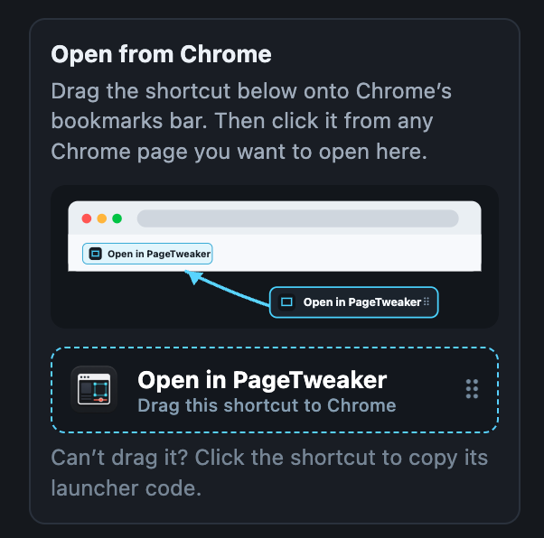
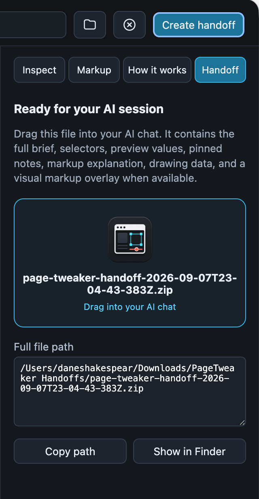

# AI PagePolish by PageTweaker

## Stop explaining. Show your AI.


**AI PagePolish by PageTweaker is a visual feedback tool for AI-built websites.**

### [Download for macOS (Apple Silicon)](https://github.com/DaneShakespear/page-tweaker/releases/download/v0.2.0/AI%20PagePolish%20by%20PageTweaker-0.2.0-arm64.dmg)

Download the DMG, open it, and drag the app into Applications.

Sometimes you know a page feels wrong, but you do not know the exact change until you see it.

Open the page. Try the adjustment visually. Mark up what you mean. Then drag one complete brief back into your AI chat.

No more “make it a little bigger,” “not that big,” or “try a different gray.”


## Open it. Adjust it. Show AI.

1. **Open any page or image.** Drag an HTML file, screenshot, image, or live website URL onto the app, its window, or its icon. You can also paste a screenshot from your clipboard, type an address, or open the current Chrome page with the included shortcut.
2. **Show what should change.** Adjust text, colors, margins, padding, and spacing. Switch between desktop, tablet, and mobile. Draw, circle, sketch, and add short explanations.
3. **Drag it back to AI.** Create the handoff, then drag it directly into Codex, Claude, ChatGPT, or another AI chat.

Your original page is never changed.

## Start from almost anywhere


Drop a page or image into the app. Paste a screenshot. Paste an address. Choose a file. Or drag the **Open in AI PagePolish by PageTweaker** shortcut from the app onto Chrome’s bookmarks bar once.

After that, one click opens the current Chrome page in the app. No browser extension is required.



## Show exactly what you mean

- Resize or rewrite text.
- Change weight, color, spacing, margins, and padding.
- Apply a visual adjustment to one item or matching items across the page.
- Keep desktop, tablet, and mobile feedback separate.
- Circle problems, sketch ideas, and group several marks under one explanation.
- Pin a note directly to the element it describes.
- Move through multiple pages without mixing their feedback.
- Mark up screenshots and other image files with the same drawing and handoff tools.

The app gives you room to try the idea before asking AI to build it.

Because sometimes you do not know what you want until you see it.

## Give AI one complete brief



The handoff includes:

- annotated screenshots;
- your drawings and explanations;
- pinned notes and written instructions;
- the pages and elements you referenced;
- the adjustments you tested;
- a plain-language brief explaining what you want.

The handoff shows AI the desired result. It does not prescribe how the code must be written. Your AI can inspect the real project and make the change the right way.

## Install on macOS

### [Download v0.2.0 for macOS (Apple Silicon)](https://github.com/DaneShakespear/page-tweaker/releases/download/v0.2.0/AI%20PagePolish%20by%20PageTweaker-0.2.0-arm64.dmg)

AI PagePolish by PageTweaker is ad-hoc signed for bundle integrity. It is not Apple Developer ID signed or notarized, so macOS may show a first-launch warning. Follow the safe per-app steps in [Installing AI PagePolish by PageTweaker](docs/INSTALLING.md). Never disable Gatekeeper system-wide.

## What it does not do

The app does not edit your source files, deploy your website, store passwords, or copy browser cookies and login tokens. It keeps its own website session when you sign in inside the app, and all preview feedback stays local until you create a handoff ZIP.

<details>
<summary><strong>Run from source and contribute</strong></summary>

Requirements: macOS, Node.js 20 or newer, and npm.

```sh
git clone https://github.com/DaneShakespear/page-tweaker.git
cd page-tweaker
npm install
npm start
```

Do not open `src/index.html` directly in a normal browser. Page selection, native file operations, app links, and handoff export require the Electron runtime.

```sh
npm test
npm run package:mac
npm run smoke:ui
```

See [Contributing](CONTRIBUTING.md), [Security](SECURITY.md), and [Current technical state](docs/CURRENT-STATE.md).

</details>

Source is publicly visible. The repository does not currently grant an open-source license or reuse rights.
